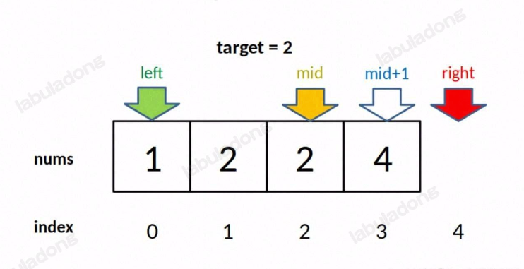
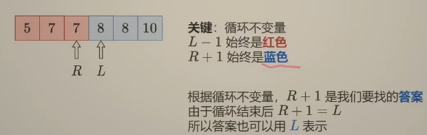

> Problem: [34. 在排序数组中查找元素的第一个和最后一个位置](https://leetcode.cn/problems/find-first-and-last-position-of-element-in-sorted-array/description/)

🐷[我的leetcode主页](https://leetcode.cn/u/qui22ical-gagariny8t/)

[TOC]

# 题目
给你一个按照非递减顺序排列的整数数组 nums，和一个目标值 target。请你找出给定目标值在数组中的开始位置和结束位置。

如果数组中不存在目标值 target，返回 [-1, -1]。

你必须设计并实现时间复杂度为 O(log n) 的算法解决此问题。

示例 1：

输入：nums = [5,7,7,8,8,10], target = 8
输出：[3,4]
示例 2：

输入：nums = [5,7,7,8,8,10], target = 6
输出：[-1,-1]
示例 3：

输入：nums = [], target = 0
输出：[-1,-1]
提示：

0 <= nums.length <= 105
-109 <= nums[i] <= 109
nums 是一个非递减数组
-109 <= target <= 109
# 分类
二分法
# 思路
## 二分法的几个注意点
1. while条件，即循环的终止条件

2. low左边界和右边界的+1，-1

3. 什么时候返回-1

# 解题方法

## 寻找一个数（最基本的二分查找）
1. while条件，即循环的终止条件

初始化low,high=0,len(nums)-1，所有搜索区间是[low,high]

所以while条件是low<=high，终止条件即[low+1,low]，带入数字为[3,2]那么这个区间是为空的，满足终止的条件 

如果while条件是low<high，终止条件即[low,low]，带入数字为[2,2]那么这个区间还剩下2，就会漏掉一个数，不满足终止的条件

2. 左边界和右边界的+1，-1

如果nums[mid]==target，因为只有一个数与target相等直接返回mid即可

当nums[mid]<target，说明在mid左侧的区间不包含target，那么搜索区间右移，为[mid+1,high]，因为mid已经搜索过，排除掉

当nums[mid]>target，说明在mid右侧的区间不包含target，那么搜索区间左移，为[low,mid-1]，因为mid已经搜索过，排除掉

3. 什么时候返回-1

如果遍历完[low,high]整个区间都没有target，那么返回-1，即在while最后返回-1，说明没找到target

该方法只满足只有一个target的前提下，因为如果是nums = [1,2,2,2,3]，target=2,那么返回的值是2，最中间的2=target.

如果要求左右边界，那么该种方法就不满足了。

## 寻找左边界
**为了统一，避免混乱，所以三种都采用闭区间[low,high],所以while条件同上**
1. while条件，即循环的终止条件

同上。

2. 左边界和右边界的+1，-1

同上。

3. 什么时候返回-1

因为是左边界，low初始值为0，后续只会增加，所以在low>=len(nums)的时候，说明不存在target，返回-1

这样填写 if low < 0 or low >= len(nums) ，是为了保持左右都判断的好习惯

最终判断low如果和target相等，那么就是左边界，不相等返回-1

return low if nums[low] == target else -1
**当然也可以不采用闭区间，采用左闭右开的区间，即[low,high)**
1. while条件，即循环的终止条件

因为是左闭右开的搜索区间，那么while low < high，搜索区间是[low,high)

终止条件是low=high，即[low,low)，代入数字为[2,2]那么这个区间为空，满足终止条件

2. 左边界和右边界的+1，-1

如果nums[mid]==target，那么说明找到了一个target，要求左边界，搜索区间要左移，即右边界要替换为mid，high=mid，搜索区间为[low,mid)

当nums[mid]<target，说明在mid左侧的区间不包含target，那么搜索区间右移，为[mid+1,high)，因为mid已经搜索过，排除掉

当nums[mid]>target，说明在mid右侧的区间不包含target，那么搜索区间左移，为[low,mid-1)，因为mid已经搜索过，排除掉

3. 什么时候返回-1

因为是左边界，low初始值为0，后续只会增加，所以在low>=len(nums)的时候，说明不存在target，返回-1

这样填写 if low < 0 or low >= len(nums) ，是为了保持左右都判断的好习惯

最终判断high如果和target相等，那么就是右边界，不相等返回-1

return low if nums[low] == target else -1

## 寻找右边界
**为了统一，避免混乱，所以三种都采用闭区间[low,high],所以while条件同上**
1. while条件，即循环的终止条件

同上。

2. 左边界和右边界的+1，-1

同上。

3. 什么时候返回-1

因为是右边界，high初始值为len(nums)-1，后续只会减小，所以在high<0的时候，说明不存在target，返回-1

这样填写 if high < 0 or high >= len(nums)，是为了保持左右都判断的好习惯

最终判断high如果和target相等，那么就是右边界，不相等返回-1

return high if nums[high] == target else -1
**当然也可以不采用闭区间，采用左闭右开的区间，即[low,high)**
1. while条件，即循环的终止条件

因为是左闭右开的搜索区间，那么while low < high，搜索区间是[low,high)，

终止条件是low=high，即[low,low)，代入数字为[2,2]那么这个区间为空，满足终止条件

2. 左边界和右边界的+1，-1

如果nums[mid]==target，那么说明找到了一个target，要求左边界，搜索区间要左移，即右边界要替换为mid，high=mid，搜索区间为[low,mid)

当nums[mid]<target，说明在mid左侧的区间不包含target，那么搜索区间右移，为[mid+1,high)，因为mid已经搜索过，排除掉

当nums[mid]>target，说明在mid右侧的区间不包含target，那么搜索区间左移，为[low,mid-1)，因为mid已经搜索过，排除掉

3. 什么时候返回-1

因为是左边界，low初始值为0，后续只会增加，所以在low>=len(nums)的时候，说明不存在target，返回-1

这样填写 if low < 0 or low >= len(nums) ，是为了保持左右都判断的好习惯

最终判断high如果和target相等，那么high-1就是右边界，不相等返回-1

return high -1 if nums[high] == target else -1
>为什么最后的结果是high-1不是high？
因为终止条件时，low = high = mid +1 ，测试mid值和target相等，mid +1 一定不和target相等，所以返回low = high的前一个索引，high-1
> 借用一张图表示
> 
## Code
### 采用闭区间求左右边界
```python
class Solution(object):

    def searchRange(self, nums, target):
        """
        :type nums: List[int]
        :type target: int
        :rtype: List[int]
        """
        def left_bound( nums, target):
            low, high = 0, len(nums) - 1
            while low <= high:
                mid = (low + high) // 2
                if nums[mid] == target:
                    high = mid - 1
                elif nums[mid] < target:
                    low = mid + 1
                else:
                    high = mid - 1
            if low < 0 or low >= len(nums):
                return -1
            return low if nums[low] == target else -1  


        def right_bound(nums, target):
            low, high = 0, len(nums) - 1
            while low <= high:
                mid = (low + high) // 2
                if nums[mid] == target:
                    low = mid + 1
                elif nums[mid] < target:
                    low = mid + 1
                else:
                    high = mid - 1
            if high < 0 or high >= len(nums):
                return -1
            return high if nums[high] == target else -1
        left = left_bound(nums,target)
        right = right_bound(nums,target)
        return [left,right]

```
### 采用左闭右开区间
```python
class Solution(object):
    def searchRange(self, nums, target):
        """
        :type nums: List[int]
        :type target: int
        :rtype: List[int]
        """
 

        def left_bound2(nums, target):
            low, high = 0, len(nums)
            while low < high:  # 因为区间为右开，所以不需要-1
                mid = (low + high) // 2
                if nums[mid] == target:
                    high = mid
                elif nums[mid] < target:
                    low = mid + 1
                else:
                    high = mid  # 因为区间为右开，所以不需要-1
            if low < 0 or low >= len(nums):
                return -1
            return low if nums[low] == target else -1  # while 循环的终止条件是 low == high，所以返回 low 和 high 是一样的


        def right_bound2(nums, target):
            low, high = 0, len(nums)
            while low < high:
                mid = (low + high) // 2
                if nums[mid] == target:
                    low = mid + 1
                elif nums[mid] < target:
                    low = mid + 1
                else:
                    high = mid
            if high-1 < 0 or high-1 >= len(nums):
                return -1
            return high - 1 if nums[high - 1] == target else -1  # while 循环的终止条件是 low == high，所以返回 low 和 high 是一样的
        left = left_bound2(nums,target)
        right = right_bound2(nums,target)
        return [left,right]
```

# 学习灵茶更新
## 红蓝染色法思路
>核心：循环不变量
> L-1始终是红色（小于target），R+1始终是蓝色（大于target）
> 
## 模板解法
### 左闭右闭 [left,right]
```python
def left_bound(nums,target):
    left = 0
    right = len(nums)-1 
    while left <= right: # 终止条件就是left>right
        mid = (left + right) // 2
        if nums[mid] < target:
            left = mid +1 # 要查找的区间是[mid+1.right]
        else:
            right = mid -1 #要查找的区间是[left,mid-1]
    return left # 终止条件满足时，left = right +1 即就是target的位置
```
### 左闭右开 [left,right)
```python
def left_bound(nums,target):
    left = 0
    right = len(nums)
    while left < right: # 终止条件就是left=right
        mid = (left + right) // 2
        if nums[mid] < target:
            left = mid +1 # 要查找的区间是[mid+1.right)
        else:
            right = mid  #要查找的区间是[left,mid),所以mid不-1
    return left # 终止条件满足时，left = right  即就是target的位置，返回right也可以
```
### 左开右开(left,right)
```python
def left_bound(nums,target):
    left = -1
    right = len(nums)
    while left+1 < right: # 终止条件就是left=right
        mid = (left + right) // 2
        if nums[mid] < target:
            left = mid  # 要查找的区间是(mid.right),所以mid不+1
        else:
            right = mid  #要查找的区间是(left,mid),所以mid不-1
    return left+1 # 终止条件满足时，left+1 = right  即就是target的位置，返回right也可以
```
## 举一反三
如果不是找>=target，而是：>,<,<=，可以在此基础上转换

如果求>target，即是>=target+1，那么就转换为求>=target+1

如果求<target，即是(>=target)左边的数，那么就转换为求(>=target)-1

如果求<=target，即是(>target)左边的数，那么就转换为求(>target)-1，进一步转换为(>=target+1)-1

左边位置即>=target的位置，右边位置即<=target的位置，转换为(>=target+1)-1

那么题目34的解法就应该是

```python
def searchRange(self, nums, target):
    def left_bound(nums,target):
        left = 0
        right = len(nums)-1 
        while left <= right: # 终止条件就是left>right
            mid = (left + right) // 2
            if nums[mid] < target:
                left = mid +1 # 要查找的区间是[mid+1.right]
            else:
                right = mid -1 #要查找的区间是[left,mid-1]
        return left # 终止条件满足时，left = right +1 即就是target的位置
    start = left_bound(nums,target)
    if start == len(nums) or nums[start] != target:# 数组为空的情况或者数组都不等于target
        return [-1,-1]
    end = left_bound(nums,target+1)-1
    return[start,end]
```

