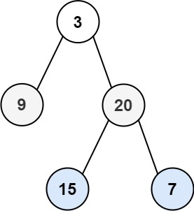

> Problem: [102. 二叉树的层序遍历](https://leetcode.cn/problems/binary-tree-level-order-traversal/description/)
> 
🐷[我的leetcode主页](https://leetcode.cn/u/qui22ical-gagariny8t/)

[TOC]

# 题目
给你二叉树的根节点 root ，返回其节点值的 层序遍历 。 （即逐层地，从左到右访问所有节点）。

示例 1：


输入：root = [3,9,20,null,null,15,7]
输出：[[3],[9,20],[15,7]]
示例 2：

输入：root = [1]
输出：[[1]]
示例 3：

输入：root = []
输出：[]
 

提示：

树中节点数目在范围 [0, 2000] 内
-1000 <= Node.val <= 1000
# 分类
递归，迭代，广度优先遍历
# 思路
采用队列存储每一层的节点，然后判断节点是否存在左右节点，如果存在，则将左右节点加入队列

中间变量列表存储每一层节点，每层遍历结束后追加到结果列表中

# 解题方法

## 迭代

### 时间复杂度
O(n)
### Code
```python
class TreeNode(object):
    def __init__(self, val=0, left=None, right=None):
        self.val = val
        self.left = left
        self.right = right
class Solution(object):
    def levelOrder(self, root):
        """
        迭代
        """
        res = []
        if not root:
            return res
        queue = [root]
        while queue:
            size = len(queue)
            # 存储每一层的节点
            level = []
            for i in range(size):
                node = queue.pop(0)
                level.append(node.val)
                if node.left:
                    queue.append(node.left)
                if node.right:
                    queue.append(node.right)
            res.append(level)
        return res
```
## 递归
### 时间复杂度
O(n)
### Code
```python
class TreeNode(object):
    def __init__(self, val=0, left=None, right=None):
        self.val = val
        self.left = left
        self.right = right
class Solution(object):

    def levelOrder(self, root):
        """
        递归
        """
        if not root:
            return []
        res = []
        # depth 为当前节点所在的层数
        def dfs(node, depth):
            if not node:
                return
            # 如果当前层数等于res的长度，说明当前层还没有添加节点，则添加一个空列表占位
            if len(res) == depth:
                res.append([])
            res[depth].append(node.val)
            # 递归遍历左右子树
            dfs(node.left, depth + 1)
            dfs(node.right, depth + 1)
        # 从根节点开始遍历
        dfs(root, 0)
        return res
```