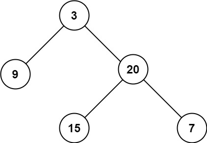

> Problem: [104. 二叉树的最大深度](https://leetcode.cn/problems/maximum-depth-of-binary-tree/description/)

🐷[我的leetcode主页](https://leetcode.cn/u/qui22ical-gagariny8t/)

[TOC]

# 题目
给定一个二叉树 root ，返回其最大深度。

二叉树的 最大深度 是指从根节点到最远叶子节点的最长路径上的节点数。

示例 1：


输入：root = [3,9,20,null,null,15,7]
输出：3
示例 2：

输入：root = [1,null,2]
输出：2

提示：

树中节点的数量在 [0, 104] 区间内。
-100 <= Node.val <= 100

# 分类
广度优先遍历，递归，迭代，队列
# 思路
遍历节点，如果存在左子树或者右子树，那么深度+1

如果不存在根节点，那么深度为0

# 解题方法

## 递归
确定最小单元：即一个节点+左右子树，返回左子树和右子树中的最大值

如果没有根节点，深度为0

如果只有一层子树，那么深度为1

如果只有左子树，那么深度为左子树深度加1，如果只有右子树，那么深度为右子树深度加1

如果左右子树都有，返回左右子树中的最大值加1

### 时间复杂度
因为递归调用的深度为最长路径，即O(n)
### Code
```python
# class TreeNode(object):
#     def __init__(self, val=0, left=None, right=None):
#         self.val = val
#         self.left = left
#         self.right = right
class Solution(object):
    """
    递归遍历
    """
    def maxDepth(self, root):
        """
        :type root: TreeNode
        :rtype: int
        """
        # 如果没有根节点，深度为0
        if not root:
            return 0
        # 如果根节点没有左子树和右子树，深度为1
        if not root.left and not root.right:
            return 1
        # 如果根节点没有左子树，则深度为右子树深度加1
        if not root.left:
            return self.maxDepth(root.right) + 1
        # 如果根节点没有右子树，则深度为左子树深度加1
        if not root.right:
            return self.maxDepth(root.left) + 1
        # 如果根节点左右子树都有，则深度为左右子树深度的较大值加1
        return max(self.maxDepth(root.left), self.maxDepth(root.right)) + 1
```

## 迭代
用队列来保存节点，每次弹出一个节点，如果存在左子树或者右子树，那么深度+1（注意+1要在每次遍历完该次queue，即左右子树都遍历完之后再+1）

最后的深度即是队列循环次数，即满足while条件的次数
### 时间复杂度
因为迭代调用的深度为最长路径，即O(n)
### Code
```python
class TreeNode(object):
    def __init__(self, val=0, left=None, right=None):
        self.val = val
        self.left = left
        self.right = right
class Solution(object):
    """
    迭代遍历
    """
    def maxDepth(self, root):
        """
        :type root: TreeNode
        :rtype: int
        """
        # 如果没有根节点，深度为0
        if not root:
            return 0
        # 创建一个队列，将根节点加入队列
        queue = [root]
        # 创建一个变量，记录深度
        depth = 0
        # 循环遍历队列
        while queue:
            # 获取队列长度
            size = len(queue)
            # 循环遍历
            for i in range(size):
                # 弹出队列的第一个元素
                node = queue.pop(0)
                # 如果弹出的元素有左子树，则将左子树加入队列
                if node.left:
                    queue.append(node.left)
                # 如果弹出的元素有右子树，则将右子树加入
                if node.right:
                    queue.append(node.right)
            # 每queue循环一次，深度加1
            depth += 1
            return depth
```