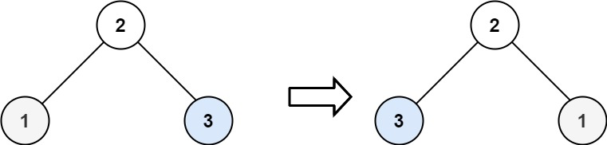

> Problem: [226. 翻转二叉树](https://leetcode.cn/problems/invert-binary-tree/description/)

🐷[我的leetcode主页](https://leetcode.cn/u/qui22ical-gagariny8t/)

[TOC]

# 题目
给你一棵二叉树的根节点 root ，翻转这棵二叉树，并返回其根节点。

 

示例 1：


输入：root = [4,2,7,1,3,6,9]
输出：[4,7,2,9,6,3,1]
示例 2：


输入：root = [2,1,3]
输出：[2,3,1]
示例 3：

输入：root = []
输出：[]
 

提示：

树中节点数目范围在 [0, 100] 内
-100 <= Node.val <= 100
# 分类
迭代，递归，广度优先遍历
# 思路
迭代思想，每次在队列中取出元素，然后交换左右节点，然后继续迭代。

# 解题方法

## 迭代
### 时间复杂度
$O(n)$
### Code
```python
class TreeNode:
    def __init__(self, val=0, left=None, right=None):
        self.val = val
        self.left = left
        self.right = right
class Solution:
    def invertTree(self, root: [TreeNode]) -> [TreeNode]:
        """
        迭代
        """
        # 如果不存在根节点，直接返回None
        if not root:
            return None
        queue = [root]
        while queue:
            size = len(queue)
            for i in range(size):
                q = queue.pop(0)
                # 交换每个节点的左右子节点
                q.left,q.right = q.right,q.left
            if q.right:
                queue.append(q.right)
            if q.left:
                queue.append(q.left)
        return root
```
## 递归
### 时间复杂度
$O(n)$
递归的思路是，每次递归时，将当前节点的左右节点交换，然后递归调用左右节点。
### Code
```python
class TreeNode:
    def __init__(self, val=0, left=None, right=None):
        self.val = val
        self.left = left
        self.right = right
class Solution:
    def invertTree(self, root: [TreeNode]) -> [TreeNode]:
 
        """
        递归
        """
        if not root:
            return None
        root.left,root.right = root.right,root.left
        self.invertTree(root.left)
        self.invertTree(root.right)
        return root
```