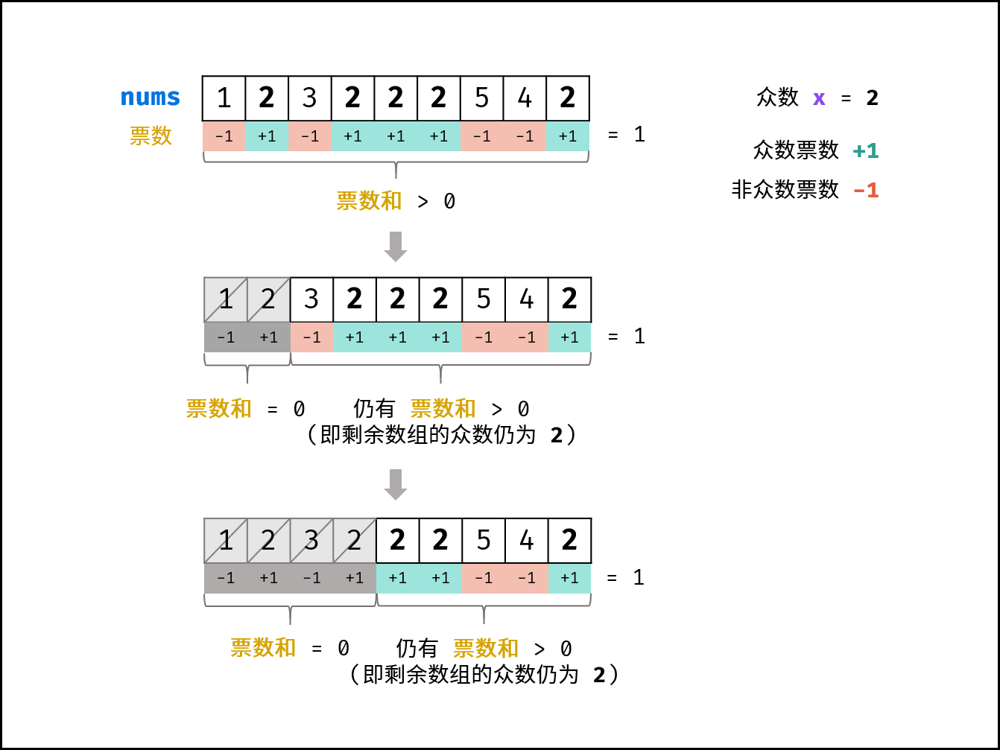

> Problem: [169. 多数元素](https://leetcode.cn/problems/majority-element/description/)

[TOC]

# 题目
给定一个大小为 n 的数组 nums ，返回其中的多数元素。多数元素是指在数组中出现次数 大于 ⌊ n/2 ⌋ 的元素。
你可以假设数组是非空的，并且给定的数组总是存在多数元素。

示例 1：

输入：nums = [3,2,3]
输出：3
示例 2：

输入：nums = [2,2,1,1,1,2,2]
输出：2
 

提示：
n == nums.length
1 <= n <= 5 * 104
-109 <= nums[i] <= 109
 

进阶：尝试设计时间复杂度为 O(n)、空间复杂度为 O(1) 的算法解决此问题。


# 思路

> 看到题目的第一想法是用一个dict存放每个元素和次数，遍历次数如果大于n/2，则返回。
> 但是疑问是如果有两个元素的出现次数一样企鹅都大于n/2，是都返回吗？

# 解题方法
## 个人解题方法
本质上是哈希表统计
> 1.借助Counter统计nums的每个元素出现次数，返回结果是一个Counter对象<br>
> 2.遍历Counter.items()，是一个dict对象<br>
> 3.如果出现次数（v）大于n/2，直接返回这个元素（k）[这种思路默认了只有一个元素出现次数 > n/2]
## 别人的优秀解题方法
摩尔投票法:核心理念为**票数正负抵消**
>1.记众数的票数为+1，非众数票数为-1，那么一定存在众数的前提下，最终的>0<br>
>2.若数组的前a个数字的票数和=0 ，则数组剩余(n−a)个数字的票数和一定仍>0，即后 (n−a)数字的众数仍为x<br>

## 排序法
对列表排序后，坐标在n/2的元素一定是众数。
# Code
## 哈希表统计
```python
def majorityElement(nums):
    from collections import Counter
    counter = Counter(nums)
    for k, v in counter.items():
        if v > len(nums) / 2:
            return k
```
>counter：Counter({2: 4, 1: 3})不能直接遍历<br>
>counter.items()：dict_items([(2, 4), (1, 3)])可以遍历
## 摩尔投票
```python
def majorityElement(nums):
    votes = 0
    for num in nums:
        if votes == 0:
            x = num
        if num == x:
            votes += 1
        else:
            votes -= 1
    return x
```
1. 最初：[2,2,1,1,1,2,2]，初始化votes=0，那么第一个元素2为众数，x=2
2. 第一次循环：num=2,满足条件votes=0，x=2,满足条件num == x，votes+=1，votes=1
3. 第二次循环：num=2,x=2,满足条件num == x，votes+=1，votes=2
4. 第三次循环：num=1,votes-=1，votes=1，x还是2
5. 第四次循环：num=1,votes-=1，votes=0，x还是2
6. 第五次循环：num=1,满足条件votes=0，x=1,满足条件num == x，votes+=1，votes=1
7. 第六次循环：num=2，x=1，votes-=1，votes=0
8. 第七次循环：num=2，满足条件votes=0，x=2，满足条件num == x，votes+=1，votes=1
## 排序法
```python
def majorityElement(nums):
    nums.sort()
    return nums[len(nums)//2]
```
